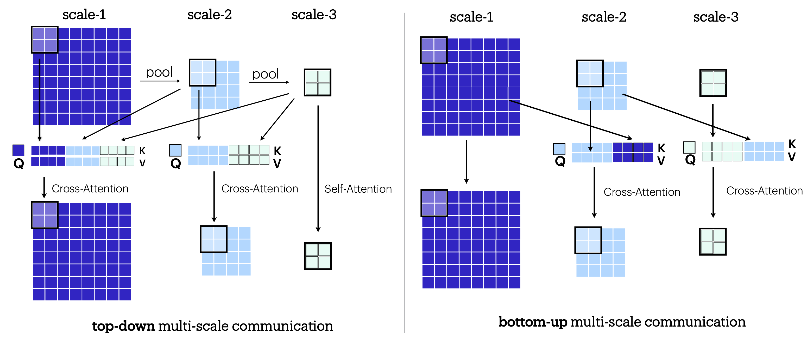

# Atlas: Multi-Scale Attention Improves Long Context Image Modeling

[Kumar Krishna Agrawal*](https://people.eecs.berkeley.edu/~krishna/), [Long Lian*](https://tonylian.com/), [Longchao Liu](), [Natalia Harguindeguy](), [Boyi Li](https://sites.google.com/site/boyilics/home), [Alexander Bick](), [Maggie Chung](), [Trevor Darrell](https://people.eecs.berkeley.edu/~trevor/),  [Adam Yala](https://www.adamyala.org/) 


Efficiently modeling massive images is a long-standing challenge in machine learning. To this end, we introduce Multi-Scale Attention (MSA). MSA relies on two key ideas, (i) multi-scale representations (ii) bi-directional cross-scale communication. MSA creates O(log N) scales to represent the image across progressively coarser features and leverages cross-attention to propagate information across scales. We then introduce Atlas, a novel neural network architecture based on MSA. We demonstrate that Atlas significantly improves the compute-performance tradeoff of long-context image modeling in a high-resolution variant of ImageNet 100. At 1024px resolution, Atlas-B achieves 91.04% accuracy, comparable to ConvNext-B (91.92%) while being 4.3x faster. Atlas is 2.95x faster and 7.38% better than FasterViT, 2.25x faster and 4.96% better than LongViT. In comparisons against MambaVision-S, we find Atlas-S achieves 5%, 16% and 32% higher accuracy at 1024px, 2048px and 4096px respectively, while obtaining similar runtimes.

#### Key Ideas

- **Multi-Scale Attention (MSA)**: MSA creates O(log N) scales to represent the image across progressively coarser features and leverages cross-attention to propagate information across scales.
- **Bi-Directional Cross-Scale Communication**: MSA enables bi-directional cross-scale communication to propagate information across scales.




## Training Atlas

### Installation
You need to install [Miniconda](https://docs.anaconda.com/miniconda/miniconda-install/) first and then run the command.
```sh
# Ensure you are in the clone of this repo
conda env create -f environment.yaml
conda activate atlas
```

### Training
To train Atlas on 1024 x 1024 ImageNet 100, you can use the following command.
```sh
python -m torch.distributed.run --master_port 8844 --master_addr 127.0.0.1 --nproc_per_node=8 train.py configs/atlas_B_res1024.yaml
```

### Comparison of Vision Backbones


Comparison of vision backbones on 1024x1024 image resolution on the HR-IN100 benchmark. Each model is evaluated on runtime (in hours), relative speed compared to Atlas, and Top-1 accuracy (in %). All models are base scale and were trained for 320 epochs until convergence on single 8 × H100 GPU node.

| Architecture | Model | Runtime (hr) ↓ | Relative speedup ↓ | Top-1 Acc. (%) ↑ |
|--------------|-------|---------------|-------------------|-----------------|
| Transformer | ViT-B | 26.77 | 1.15x | 90.66 |
| | Swin-B | 37.25 | 1.6x | 90.89 |
| | FasterViT-4 | 68.31 | 2.9× | 83.66 |
| | LongViT-B | 52.23 | 2.2× | 86.08 |
| Convolutional | ConvNext-B | 100.11 | 4.3× | 91.92 |
| Mamba | MambaVision-B | 22.69 | 0.98× | 84.86 |
| Multi-Scale | Atlas-B | 23.12 | 1.00× | 91.04 |


## Contact us
Please contact Kumar Krishna Agrawal if you have any questions: `kagrawal@berkeley.edu`.


## Acknowledgements
We thank the authors of [FasterViT](https://github.com/NVlabs/FasterViT), [MambaVision](https://github.com/NVlabs/MambaVision), [CMC](https://github.com/HobbitLong/CMC/) and [Timm](https://github.com/huggingface/pytorch-image-models) for their valuable open-source contributions that significantly influenced this work.

## Citation
If you use our work or our implementation in this repo, or find them helpful, please consider giving a citation.
```
@article{agrawalk2025atlas,
  title={Atlas: Multi-Scale Attention Improves Long Context Image Modeling},
    author={Agrawal, Kumar Krishna and Lian, Tony and Liu, Longchao and Harguindeguy, Natalia and Li, Boyi and Bick, Alexander and Chung, Maggie and Darrell, Trevor and Yala, Adam},
    journal={arXiv preprint arXiv:2503.12355},
    year={2025}
}
```
